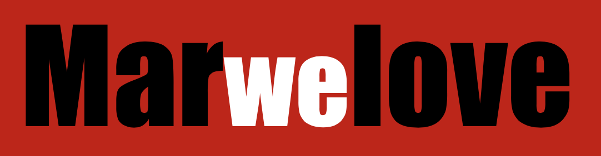

<p>
&nbsp;
</p>


[]()
[](https://github.com/rufusnufus/marwelove/graphs/contributors)
[](https://github.com/rufusnufus/marwelove/blob/master/LICENSE)

<br>

## Overview
This is web app written using [React](https://reactjs.org) and [MarvelAPI](https://developer.marvel.com) showing marvel characters and comics.

## Available Scripts

In the project directory, you can run:
```bash
npm start
```

Runs the app in the development mode.
Open [http://localhost:3000](http://localhost:3000) to view it in the browser.

The page will reload if you make edits.
You will also see any lint errors in the console.

## Contacts
If you have any questions or ideas, write us in [Telegram](https://telegram.org):
* [@MatInd0](https://t.me/MatInd0/)
* [@rufusnufus](https://t.me/rufusnufus/)
